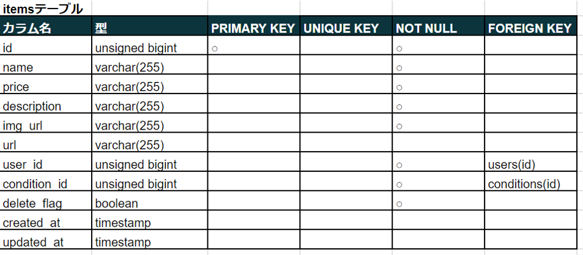
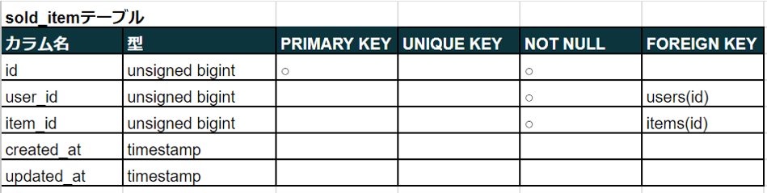
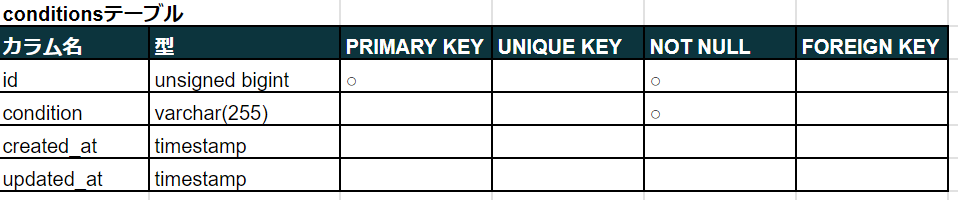

# coachtech フリマ
 独自のフリマアプリ

< --- トップ画面の画像 ---- >

## 作成した目的
coachtechブランドのアイテムを出品する

## 機能一覧
- 会員登録
- ログイン
- ログアウト
- 商品一覧取得
- 商品詳細取得
- ユーザ商品お気に入り一覧取得
- ユーザ情報取得
- ユーザ購入商品一覧取得
- ユーザ出品商品一覧取得
- プロフィール変更
- 商品お気に入り追加
- 商品お気に入り削除
- 商品コメント追加
- 商品コメント削除
- 出品
- 購入
- 配送先変更

## 使用技術（実行環境）
- Laravel 9.x
- Blade
- tailwindcss
- alpinejs

## テーブル設計

## ER図

## 環境構築
- git clone https://github.com/yu-tooo/coachtech-flma.git
- npm run build
- php artisan serve