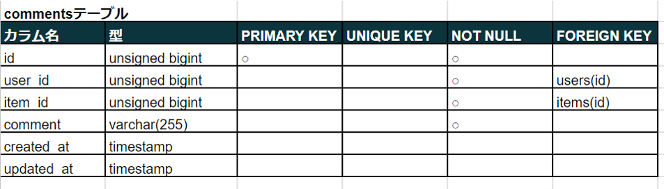

# coachtech フリマ
独自のフリマアプリ


## 作成した目的
coachtechブランドのアイテムを出品する

## 機能一覧
### ユーザ画面
- 会員登録
- ログイン
- ログアウト
- 商品一覧取得
- 商品詳細取得
- 参考URL (QRコード)表示
- ユーザ商品お気に入り一覧取得
- ユーザ情報取得
- ユーザ購入商品一覧取得
- ユーザ出品商品一覧取得
- プロフィール変更
- 商品お気に入り追加
- 商品お気に入り削除
- 商品コメント追加
- 商品コメント削除
- 出品
- 購入
- 配送先変更

### 管理画面
admin: 上位管理者  
owner: 下位管理者
- ログイン(owner, admin)
- ログアウト(owner, admin)
- ユーザ一覧取得(owner, admin)
- ユーザ詳細取得(owner, admin)
- ユーザ削除(admin)
- 商品一覧取得(owner, admin)
- 商品詳細取得(owner, admin)
- 商品削除(owner, admin)
- コメント削除(owner, admin)
- メール送信(owner, admin)
- owner一覧(admin)
- owner登録(admin)
- owner削除(admin)

### テスト
- ユーザ画面テスト
- 管理画面テスト

## 使用技術（実行環境）
- Laravel 9.x
- Blade
- tailwindcss
- alpinejs

## テーブル設計





## ER図


## 環境構築
### 開発環境構築
プロジェクトフォルダ内で以下を実行
```
composer install
```
設定ファイルの作成と編集
```
cp .env.example .env
php artisan key:generate
php artisan config:clear
```
シンボリックリンクを設定する
```
php artisan storage:link
```
フロントエンドのビルド
```
npm install
npm run dev
```
データベースの作成、データ挿入
```
php artisan migrate --seed
```
***
開発環境では単体テストができます
```
php artisan test
```
***
#### 初期データ
1. admin (上位管理者)  
email： admin@example.com  
password： password1234

2. ユーザ1: プロフィール設定済みユーザ
3. ユーザ2: プロフィール未設定ユーザ
4. QRコード付き商品
5. QRコードなし商品
***

### 本番環境構築
プロジェクトフォルダ内で以下を実行
```
composer install --no-dev
```
設定ファイルの作成と編集
```
cp .env.example .env
php artisan key:generate
php artisan config:clear
```
シンボリックリンクを設定する
```
php artisan storage:link
```
フロントエンドのビルド
```
npm install
npm run build
```
データベースの作成、データ挿入
```
php artisan migrate
```

### 注意事項
- mail送信機能の利用には、別途.envファイルに設定が必要。
- 本番環境を構築する場合、「adminsテーブル」と「conditionsテーブル」に初期データを挿入する。